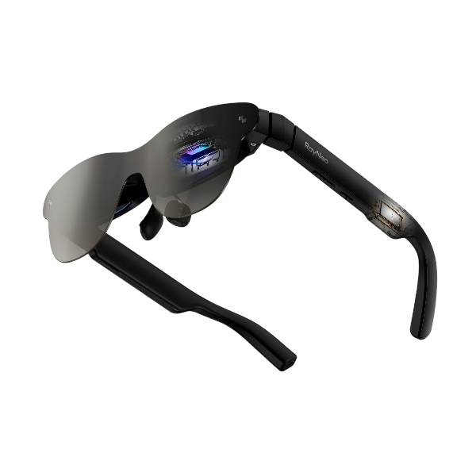

# Downloads

SDK (latest assets):
- Windows: https://github.com/verncat/RayNeo-Air-3S-Pro-OpenVR/releases/latest/download/rayneo-sdk-windows-latest.tar.gz
- macOS: https://github.com/verncat/RayNeo-Air-3S-Pro-OpenVR/releases/latest/download/rayneo-sdk-macos-latest.tar.gz
- Linux: https://github.com/verncat/RayNeo-Air-3S-Pro-OpenVR/releases/latest/download/rayneo-sdk-ubuntu-latest.tar.gz

SteamVR Driver (latest asset):
- Direct: https://github.com/verncat/RayNeo-Air-3S-Pro-OpenVR/releases/latest/download/steamvr_rayneo_driver-latest.zip

# RayNeo SDK (Work-in-Progress)

A lightweight C/C++ SDK and examples for interacting with **RayNeo Air3s Pro** (and probably other RayNeo's) devices. 

<div align="center">
  
</div>

The project currently focuses on:

- Cross-platform transport layer
  - libusb on Windows/Linux
  - Native HID (IOKit) on macOS (integrated directly in the SDK)
- Simple C API (`include/rayneo/rayneo_api.h`) for:
  - Device attach/detach events
  - IMU streaming (accel / gyro / magnet / temperature / tick)
  - Basic device info block
  - Round-trip command/ack frames
- Example applications:
  - `examples/simple` – console usage demo
  - `examples/orientation_demo` – SDL2 + OpenGL visualization
- Optional OpenVR stub driver prototype (if enabled)

> NOTE: This repository is evolving. Some components (e.g. higher-level service logic, richer device info parsing, error reporting) are intentionally minimal.

## Repository Layout

```
CMakeLists.txt                # Root build script
include/rayneo/rayneo_api.h   # Public C API header
src/RayneoApi.cpp             # Core SDK implementation
main.cpp                      # Basic client executable
examples/                     # Example apps
openvr_driver/                # Optional stub driver
rayneoSDKHeaders/             # Additional internal headers (not yet fully used) from original SDK
thirdparties/openvr/          # Third-party OpenVR bits
```

## Building

### Cloning (Git Submodules)

This repository uses git submodules (e.g. `thirdparties/openvr`). Ensure they are fetched before building:

Clone with submodules in one step:
```bash
git clone --recursive https://github.com/verncat/RayNeo-Air-3S-Pro-OpenVR.git
```

### Prerequisites

- CMake >= 3.16
- A C++17 capable compiler
- Windows: Visual Studio 2022 + vcpkg dependencies (SDL2, SDL2_ttf, libusb, etc.)
- macOS: Xcode command line tools (IOKit/CoreFoundation frameworks available by default)
- Linux: libusb-1.0 dev package, SDL2/SDL2_ttf dev packages, OpenGL

### Configure & Build (Windows example)

```powershell
# From the repository root
cmake -B build -DCMAKE_TOOLCHAIN_FILE=C:/vcpkg/scripts/buildsystems/vcpkg.cmake -DRAYNEO_BUILD_EXAMPLES=ON -DRAYNEO_BUILD_OPENVR_DRIVER=OFF
cmake --build build --config RelWithDebInfo --target RayNeoSDK
cmake --build build --config RelWithDebInfo --target RayNeoOrientationDemo
```

### macOS

```bash
cmake -B build -DRAYNEO_BUILD_EXAMPLES=ON -DRAYNEO_BUILD_OPENVR_DRIVER=OFF
cmake --build build --target RayNeoSDK --config Release
```

### Linux

```bash
cmake -B build -DRAYNEO_BUILD_EXAMPLES=ON -DRAYNEO_BUILD_OPENVR_DRIVER=OFF
cmake --build build --target RayNeoSDK --config Release
```

### Runtime Deployment (Windows)

The build copies `RayNeoSDK.dll` and (if needed) `libusb-1.0.dll` next to example executables. Additional SDL2 / freetype / zlib / png dependencies are typically auto-copied by vcpkg's app-local mechanism.

## macOS Transport Notes

macOS path uses IOKit HID APIs directly. A worker thread runs a CFRunLoop, registers an input report callback, and feeds frames into the same parser used by libusb path.

## Roadmap / TODO
- Move OpenVR Driver to the another repo
- The OpenVR stub driver shouldn't be a not stub lol
- Add crossplatform script for deploy SteamVR driver to their drivers path 
- Expand device info parsing into structured fields
- Integrate richer error codes & diagnostics
- Add unit tests for frame parser & event queue

## License

This project is released under the **MIT License** — see the [LICENSE](LICENSE) file.

## Contributing

PRs / patches welcome once the initial API surface stabilizes. Please:

1. Keep changes platform-agnostic where possible
2. Add comments for non-obvious protocol fields
3. Avoid introducing heavy dependencies without discussion

