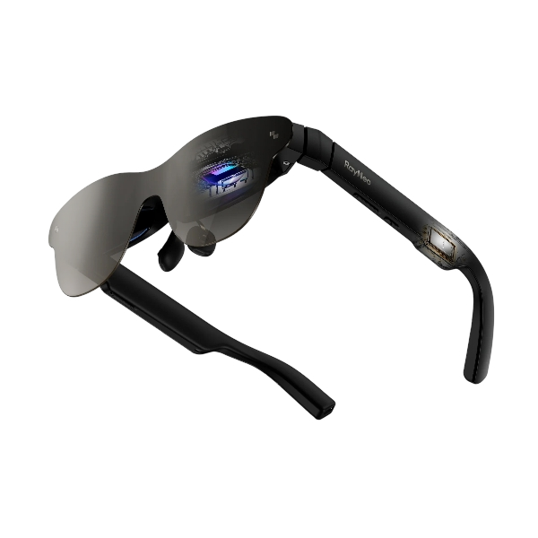

# RayNeo SDK (Work-in-Progress)

A lightweight C/C++ SDK and examples for interacting with **RayNeo Air3s Pro** (and probably other RayNeo's) devices. 

<div align="center">
  
</div>

The project currently focuses on:

- Cross-platform transport layer
  - libusb on Windows/Linux
  - Native HID (IOKit) on macOS (integrated directly in the SDK)
- Simple C API (`include/rayneo/rayneo_api.h`) for:
  - Device attach/detach events
  - IMU streaming (accel / gyro / magnet / temperature / tick)
  - Basic device info block
  - Round-trip command/ack frames
- Example applications:
  - `examples/simple` – console usage demo
  - `examples/orientation_demo` – SDL2 + OpenGL visualization
- Optional OpenVR stub driver prototype (if enabled)

> NOTE: This repository is evolving. Some components (e.g. higher-level service logic, richer device info parsing, error reporting) are intentionally minimal.

## Supported devices

| Model | USB VID | USB PID | Support notes | Related issue / PR |
| --- | --- | --- | --- | --- |
| RayNeo Air 3S Pro | `0x1BBB` | `0xAF50` | Original SDK target; included in device discovery. | - |
| RayNeo Air 4 Pro | `0x1BBB` | `0xAF50` | IMU streaming reported working by a user on macOS / Apple Silicon; discovered through the shared Air 3S Pro USB identity. | [#4: macOS compatibility report](https://github.com/verncat/RayNeo-Air-3S-Pro-OpenVR/issues/4) |
| RayNeo GT | `0x3941` | `0xAF50` | Included in device discovery, with model-specific spatial-mode notification handling. | [PR #3: GT support and hardware testing](https://github.com/verncat/RayNeo-Air-3S-Pro-OpenVR/pull/3) |

Air 3S Pro and Air 4 Pro share the same VID/PID, so discovery cannot distinguish
them by these identifiers alone. The examples display both possible model names.
The table describes SDK support, not a guarantee that every feature has been
tested on every operating system.

### Help test more devices

Help us verify the models listed above and bring support to other RayNeo glasses!
Reports from Windows, Linux, and macOS are welcome, whether everything works or
you encounter a problem. Try `examples/simple` or `examples/orientation_demo`
and [open an issue](https://github.com/verncat/RayNeo-Air-3S-Pro-OpenVR/issues)
with:

- Exact glasses model, firmware date/version, and board ID if available.
- Operating system, CPU architecture, SDK version or commit, and build toolchain.
- USB VID/PID and whether discovery finds the glasses or manual selection is needed.
- Which features work: IMU streaming, device information, attach/detach events,
  display mode switching, and button notifications. Mark untested features too.
- Example output, API return codes, and steps or a small code sample to reproduce
  any failure. If selecting an interface explicitly, include its number and the
  return code from `Rayneo_SetTargetInterface`.

For an unlisted USB identity, you can try selecting it explicitly with
`Rayneo_SetTargetVidPid(ctx, vid, pid)` before `Rayneo_Start`, without using
discovery. Successful reports help us expand the device table; unsuccessful
reports help identify differences between models and platforms.

## Download prebuilt Binaries

**SDK:**

[](https://github.com/verncat/RayNeo-Air-3S-Pro-OpenVR/actions/workflows/release.yml) 

[Windows](https://github.com/verncat/RayNeo-Air-3S-Pro-OpenVR/releases/latest/download/rayneo-sdk-windows-latest.tar.gz)
[MacOS](https://github.com/verncat/RayNeo-Air-3S-Pro-OpenVR/releases/latest/download/rayneo-sdk-macos-latest.tar.gz)
[Linux](https://github.com/verncat/RayNeo-Air-3S-Pro-OpenVR/releases/latest/download/rayneo-sdk-ubuntu-latest.tar.gz)

**SteamVR Driver:**
New driver has moved to separate repo: https://github.com/verncat/RayNeo-Air-3S-Pro-OpenVR-Driver

Old driver:
[](https://github.com/verncat/RayNeo-Air-3S-Pro-OpenVR/actions/workflows/steamvr-driver.yml)

[Download Linux64+Win64](https://github.com/verncat/RayNeo-Air-3S-Pro-OpenVR/releases/latest/download/steamvr_rayneo_driver-latest.zip)


## Release version

Edit `RAYNEO_API_VERSION_MAJOR`, `RAYNEO_API_VERSION_MINOR`, and
`RAYNEO_API_VERSION_PATCH` in `include/rayneo_api.h` to set the release SemVer
Use decimal integers without leading zeros. These three
macros are the single source of the version; `RAYNEO_VERSION_STRING` is derived
automatically. Major and minor must fit in 16 bits. `RAYNEO_API_VERSION` and
`Rayneo_GetApiVersion()` retain the packed major/minor format for compatibility;
patch is available through its macro and the version string.

On pushes to `main`, SDK and SteamVR builds run only when the version differs
from the header before the push and the corresponding release tag does not
exist. Manual runs compare against the parent commit. Introducing the release
macro counts as a version change; edits that keep the version unchanged do not.

Tags are `sdk-v<VERSION>` and `steamvr-driver-v<VERSION>`. Release notes include
commits since the previous reachable tag for that product and a full diff link.
Legacy timestamp tags are supported. Without a previous tag, all commits are
included. The three numeric macros define stable releases without prerelease
or build suffixes.

## Device discovery

`include/rayneo_api.h` defines per-model VID/PID macros and the shared
`RAYNEO_SUPPORTED_DEVICES(X)` table. Add new supported models to that table.
In C++, `Rayneo_GetSupportedDevices()` returns a constexpr `std::array` of
`RAYNEO_VidPid` pairs. Discovery uses the same table:

```cpp
constexpr auto supported = Rayneo_GetSupportedDevices();
RAYNEO_VidPid connected[RAYNEO_SUPPORTED_DEVICE_COUNT]{};
size_t count = 0;
RAYNEO_Result result = Rayneo_Discovery(connected, RAYNEO_SUPPORTED_DEVICE_COUNT, &count);
if (result == RAYNEO_OK && count == 1) {
    Rayneo_SetTargetVidPid(ctx, connected[0].vid, connected[0].pid);
    Rayneo_Start(ctx, 0);
}
```

Discovery returns unique connected VID/PID pairs in table order. It neither
opens the devices nor changes a context. Zero matches returns `RAYNEO_OK` with
count zero; USB enumeration failures return an error. Multiple identical devices
share one entry. For multiple different matches, the application chooses a pair.
`Rayneo_Discovery(NULL, 0, &count)` queries the count. With a smaller buffer,
only `capacity` entries are written and `count` still reports the total.
On macOS discovery enumerates HID devices; Windows/Linux use libusb.

## Repository Layout

```
CMakeLists.txt                # Root build script
include/rayneo/rayneo_api.h   # Public C API header
src/RayneoApi.cpp             # Core SDK implementation
main.cpp                      # Basic client executable
examples/                     # Example apps
openvr_driver/                # Optional stub driver
rayneoSDKHeaders/             # Additional internal headers (not yet fully used) from original SDK
thirdparties/openvr/          # Third-party OpenVR bits
```

## Building

### Cloning (Git Submodules)

This repository uses git submodules (e.g. `thirdparties/openvr`). Ensure they are fetched before building:

Clone with submodules in one step:
```bash
git clone --recursive https://github.com/verncat/RayNeo-Air-3S-Pro-OpenVR.git
```

### Prerequisites

- CMake >= 3.16
- A C++17 capable compiler
- Windows: Visual Studio 2022 + vcpkg dependencies (SDL2, SDL2_ttf, libusb, etc.)
- macOS: Xcode command line tools (IOKit/CoreFoundation frameworks available by default)
- Linux: libusb-1.0 dev package, SDL2/SDL2_ttf dev packages, OpenGL

### Configure & Build (Windows example)

```powershell
# From the repository root
cmake -B build -DCMAKE_TOOLCHAIN_FILE=C:/vcpkg/scripts/buildsystems/vcpkg.cmake -DRAYNEO_BUILD_EXAMPLES=ON -DRAYNEO_BUILD_OPENVR_DRIVER=OFF
cmake --build build --config RelWithDebInfo --target RayNeoSDK
cmake --build build --config RelWithDebInfo --target RayNeoOrientationDemo
```

### macOS

```bash
cmake -B build -DRAYNEO_BUILD_EXAMPLES=ON -DRAYNEO_BUILD_OPENVR_DRIVER=OFF
cmake --build build --target RayNeoSDK --config Release
```

### Linux

```bash
cmake -B build -DRAYNEO_BUILD_EXAMPLES=ON -DRAYNEO_BUILD_OPENVR_DRIVER=OFF
cmake --build build --target RayNeoSDK --config Release
```

### Runtime Deployment (Windows)

The build copies `RayNeoSDK.dll` and (if needed) `libusb-1.0.dll` next to example executables. Additional SDL2 / freetype / zlib / png dependencies are typically auto-copied by vcpkg's app-local mechanism.

## macOS Transport Notes

macOS path uses IOKit HID APIs directly. A worker thread runs a CFRunLoop, registers an input report callback, and feeds frames into the same parser used by libusb path.

## Roadmap / TODO
- Move OpenVR Driver to the another repo
- The OpenVR stub driver shouldn't be a not stub lol
- Add crossplatform script for deploy SteamVR driver to their drivers path 
- Expand device info parsing into structured fields
- Integrate richer error codes & diagnostics
- Add unit tests for frame parser & event queue

## License

This project is released under the **MIT License** — see the [LICENSE](LICENSE) file.

## Contributing

PRs / patches welcome once the initial API surface stabilizes. Please:

1. Keep changes platform-agnostic where possible
2. Add comments for non-obvious protocol fields
3. Avoid introducing heavy dependencies without discussion
