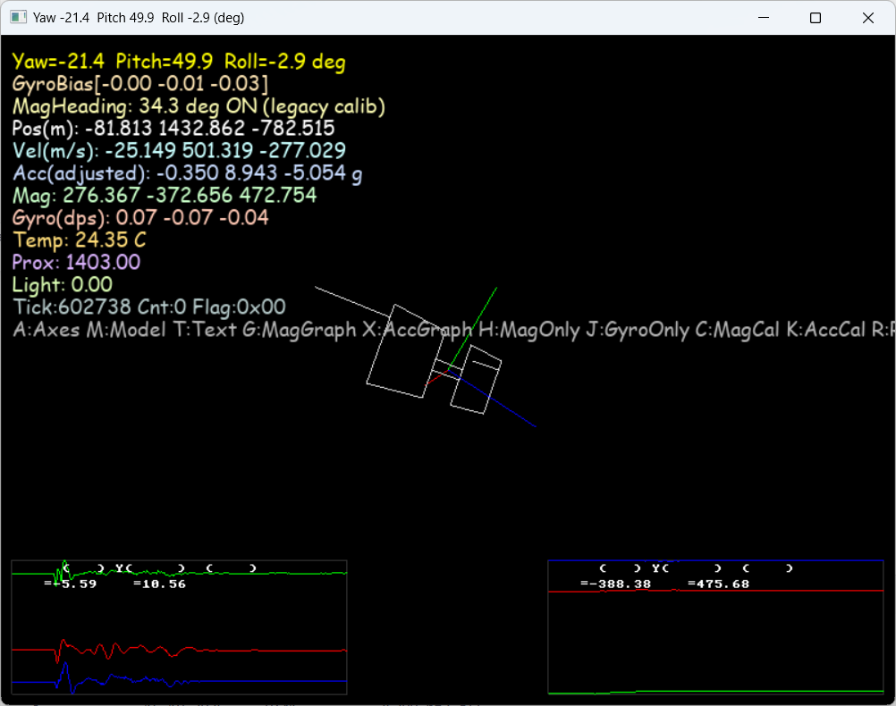

# Orientation Demo

SDL2 + OpenGL program that visualizes orientation / IMU stream from the RayNeo device.


<div align="center">
  
</div>

## Target
CMake target: `RayNeoOrientationDemo`
Output binary (multi-config): `build/examples/orientation_demo/<Config>/RayNeoOrientationDemo[.exe]`

## Build
### Windows (vcpkg toolchain)
```powershell
cmake -B build -DCMAKE_TOOLCHAIN_FILE=C:/vcpkg/scripts/buildsystems/vcpkg.cmake -DRAYNEO_BUILD_EXAMPLES=ON
cmake --build build --config RelWithDebInfo --target RayNeoOrientationDemo
```

### macOS / Linux
```bash
cmake -B build -DRAYNEO_BUILD_EXAMPLES=ON
cmake --build build --target RayNeoOrientationDemo --config Release
```

Dependencies (handled by CMake + vcpkg):
- SDL2
- SDL2_ttf (for optional text overlays)
- OpenGL
- RayNeoSDK (and libusb on non-Apple platforms)

## Run
### Windows
```powershell
cd build/examples/orientation_demo/RelWithDebInfo
./RayNeoOrientationDemo.exe
```
### macOS / Linux
```bash
./build/examples/orientation_demo/RayNeoOrientationDemo
```

If using a multi-config generator but different config (e.g. `Debug`), adjust the path accordingly.

## What It Does
1. Starts RayNeo SDK service.
2. Enables IMU streaming.
3. Polls IMU events and converts to orientation visualization (raw acceleration / gyro; optionally fused orientation if available later).
4. Renders a simple 3D representation (e.g., cube or axes) reflecting device rotation.

## Controls (if implemented)
- ESC or window close: exit program.
- Future: toggle wireframe / data overlays.

## Adjusting VID/PID
As with the simple example, modify the call to `Rayneo_SetTargetVidPid` in this demo's source if your hardware IDs differ.

## Debugging & Environment Variables
Before running you can enable debug prints:
```powershell
$env:RAYNEO_DEBUG_FRAMES=1
$env:RAYNEO_DEBUG_SHUTDOWN=1
./RayNeoOrientationDemo.exe
```
POSIX:
```bash
RAYNEO_DEBUG_FRAMES=1 RAYNEO_DEBUG_SHUTDOWN=1 ./RayNeoOrientationDemo
```

## Troubleshooting
| Symptom | Cause | Fix |
|---------|-------|-----|
| 0xC000007B error | Missing / wrong arch DLL | Ensure `RayNeoSDK.dll`, `libusb-1.0.dll`, SDL2 DLLs are x64 |
| Blank window / no motion | IMU not enabled or events not parsed | Confirm `Rayneo_EnableImu` executed; check debug frames |
| Device never attaches | Incorrect VID/PID | Verify ids with Device Manager / lsusb / system_profiler |
| macOS start hang | HID device not matched | Replug device; check permission prompts |
| SDL init failure | Missing runtime SDL DLLs | Confirm vcpkg copied them; or add to PATH |

## Extending the Demo
- Integrate quaternion fusion (Madgwick / Mahony) using raw accel + gyro.
- Display numeric orientation + IMU sample frequency.
- Add toggleable graph overlays (rolling plots for accel/gyro axes).
- Export session data to CSV.

## Future Improvements
Once orientation fusion exists in the SDK core, replace demo-side fusion with direct quaternion events.

---
*README for `examples/orientation_demo`*
